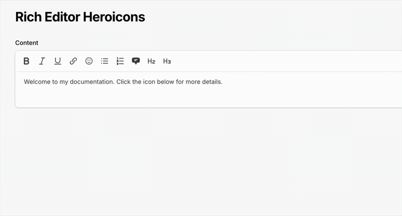

# 🦸 Filament Rich Editor Heroicons

[](https://packagist.org/packages/oliwol/filament-rich-editor-heroicons)
[](https://github.com/oliwol/filament-rich-editor-heroicons/actions)
[](https://github.com/oliwol/filament-rich-editor-heroicons/blob/0.x/LICENSE.md)

A Filament v4/v5 plugin that adds a Heroicon picker to the RichEditor (TipTap). 



Search and insert any outline Heroicon as an inline SVG directly into the editor content.

---

## 🚀 Installation

Install the package via Composer:

```bash
composer require oliwol/filament-rich-editor-heroicons
```

## ⚡️ Quick Start

```php
use Filament\Forms\Components\RichEditor;
use Oliwol\FilamentRichEditorHeroicons\FilamentRichEditorHeroicons;

RichEditor::make('content')
    ->toolbarButtons([
        'bold',
        'italic',
        'link',
        'addHeroicon',
    ])
    ->plugins([
        FilamentRichEditorHeroicons::make(),
    ])
```

## 🛠️ Usage

### Editor Integration

Add ```FilamentRichEditorHeroicons::make()``` to the ```plugins()``` array of your ```RichEditor``` component and include ```addHeroicon``` in the ```toolbarButtons()```:

```php
use Filament\Forms\Components\RichEditor;
use Oliwol\FilamentRichEditorHeroicons\FilamentRichEditorHeroicons;

RichEditor::make('content')
    ->toolbarButtons([
        'bold',
        'italic',
        'underline',
        'link',
        'addHeroicon',
        // ... other buttons
    ])
    ->plugins([
        FilamentRichEditorHeroicons::make(),
    ])
```

### Rendering Stored Content

When rendering stored content outside the editor (e.g. in a Blade view or model accessor), register the plugin with ```RichContentRenderer```:

```php
use Filament\Forms\Components\RichEditor\RichContentRenderer;
use Oliwol\FilamentRichEditorHeroicons\FilamentRichEditorHeroicons;

RichContentRenderer::make($this->html)
    ->plugins([
        FilamentRichEditorHeroicons::make(),
    ])
```

## ⚙️ How it works

1. Clicking the toolbar button opens a modal with a searchable dropdown of all outline [Heroicons](https://heroicons.com/).
2. After selecting an icon, it is rendered as an inline SVG element and inserted into the editor content.
3. The icon name is stored as a ```data-icon``` attribute, and the rendered SVG is stored as ```data-svg``` for display.

## 🌍 Translations

The package ships with English and German translations. You can publish and customize them:

```bash
php artisan vendor:publish --tag="filament-rich-editor-heroicons-translations"
```

## ✅ Testing

```bash
composer test
```

## 📄 License

This package is open-sourced software licensed under the [MIT license](LICENSE.md).
